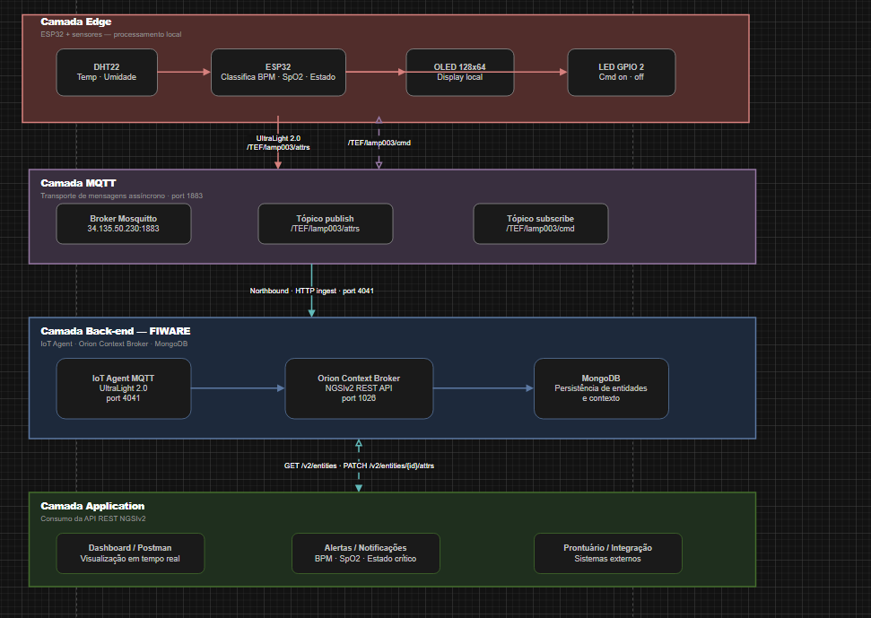

# 🫀 Care Plus — Monitoramento de Saúde com ESP32 + FIWARE

> Sistema de monitoramento de sinais vitais em tempo real utilizando ESP32, sensor DHT22, protocolo MQTT e stack FIWARE na nuvem.

---

## Integrantes

- Murilo Jeronimo Ferreira Nunes — RM560641
- Bruno Santos Castilho — RM566799
- Vinicius Kozonoe Guaglini — RM567264

---

## 📋 Sumário

- [Visão Geral](#visão-geral)
- [Arquitetura da Solução](#arquitetura-da-solução)
- [Hardware Utilizado](#hardware-utilizado)
- [Tecnologias e Protocolos](#tecnologias-e-protocolos)
- [Classificação de Saúde](#classificação-de-saúde)
- [Tópicos MQTT](#tópicos-mqtt)
- [Configuração FIWARE](#configuração-fiware)
- [Como Executar](#como-executar)
- [Sequência de Deploy](#sequência-de-deploy)
- [Endpoints da API](#endpoints-da-api)
- [Estrutura do Projeto](#estrutura-do-projeto)

---

## Visão Geral

O **Care Plus** é um sistema IoT voltado para monitoramento de saúde em ambientes hospitalares ou domiciliares.

Um dispositivo **ESP32** coleta dados de temperatura e umidade via sensor **DHT22** e, a partir dessas leituras, simula métricas vitais como:

- BPM (batimentos cardíacos)
- SpO2 (saturação de oxigênio)

Os dados são publicados via **MQTT** em tópicos específicos e processados pela stack **FIWARE** (IoT Agent + Orion Context Broker), tornando as informações disponíveis via **API REST NGSIv2**.

O dispositivo também classifica automaticamente o estado de saúde em **4 níveis** e exibe os dados em tempo real em um display OLED 128x64.

---

## Arquitetura da Solução

O sistema é organizado em **4 camadas**:



> O arquivo `CarePlus_Arquitetura.drawio` contém o diagrama completo editável. Abra com https://app.diagrams.net/

---

## Hardware Utilizado

| Componente | Função |
|---|---|
| ESP32 | Microcontrolador principal |
| DHT22 | Sensor de temperatura e umidade |
| OLED SSD1306 128x64 | Display de sinais vitais |
| LED GPIO 2 | Indicador remoto |

---

## Tecnologias e Protocolos

| Camada | Tecnologia |
|---|---|
| Firmware | C++ (Arduino / ESP-IDF) |
| Comunicação | MQTT |
| Broker | Mosquitto |
| Backend | FIWARE |
| Banco de Dados | MongoDB |
| API | NGSIv2 REST |
| Simulação | Wokwi |

---

## Classificação de Saúde

### BPM

| Estado | Faixa |
|---|---|
| ✅ Saudável | 60 – 100 bpm |
| ⚠️ Atenção | 50–59 ou 101–120 bpm |
| 🟠 Alerta | 40–49 ou 121–150 bpm |
| 🔴 Crítico | < 40 ou > 150 bpm |

### SpO2

| Estado | Faixa |
|---|---|
| ✅ Saudável | ≥ 95% |
| ⚠️ Atenção | 90 – 94% |
| 🟠 Alerta | 85 – 89% |
| 🔴 Crítico | < 85% |

---

## Tópicos MQTT

| Direção | Tópico |
|---|---|
| Publish | `/TEF/lamp003/attrs` |
| Publish | `/TEF/lamp003/attrs/bpm` |
| Publish | `/TEF/lamp003/attrs/spo2` |
| Publish | `/TEF/lamp003/attrs/sensor` |
| Subscribe | `/TEF/lamp003/cmd` |

### Exemplo Payload UltraLight

```txt
s|on|bpm|82|spo2|97|temp|28.5|umid|63.2
```

### Exemplo Payload JSON

```json
{
  "bpm": 82,
  "spo2": 97,
  "temperatura": 28.5,
  "umidade": 63.2,
  "estado": 0,
  "alerta": "OK"
}
```

---

## Configuração FIWARE

### Variáveis

```env
BROKER_IP   = 34.135.50.230
MQTT_PORT   = 1883
IOT_PORT    = 4041
ORION_PORT  = 1026
API_KEY     = TEF
DEVICE_ID   = lamp003
ENTITY_ID   = urn:ngsi-ld:Lamp:003
SERVICE     = smart
SERVICEPATH = /
```

---

## Como Executar

### 1. Instalar dependências

- WiFi.h
- PubSubClient
- DHT sensor library
- Adafruit GFX
- Adafruit SSD1306

---

### 2. Configurar firmware

```cpp
const char* SSID        = "SUA_REDE";
const char* PASSWORD    = "SUA_SENHA";

const char* BROKER_MQTT = "34.135.50.230";
const int   BROKER_PORT = 1883;
```

---

### 3. Upload para ESP32

Conecte o ESP32 e faça upload do firmware.

---

## Sequência de Deploy

```txt
1. Health Check IoT Agent
2. Verificar Orion
3. Provisionar Service Group
4. Provisionar dispositivo
5. Registrar comandos
6. Listar dispositivos
7. Listar entidades
8. Ligar ESP32
9. Testar comandos ON/OFF
```

---

## Endpoints da API

Base URL:

```txt
http://34.135.50.230
```

Headers:

```txt
fiware-service: smart
fiware-servicepath: /
```

| Método | Endpoint |
|---|---|
| GET | :4041/iot/about |
| POST | :4041/iot/services |
| POST | :4041/iot/devices |
| GET | :1026/v2/entities |

---

## Estrutura do Projeto

```txt
care-plus/
├── firmware/
│   └── care_plus.ino
├── docs/
│   ├── CarePlus_Arquitetura.drawio
│   ├── image.png
│   └── README.md
└── postman/
    └── CarePlus_FIWARE_lamp003.postman_collection.json
```